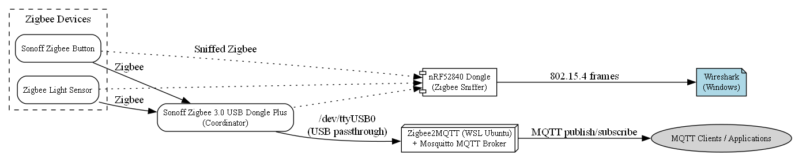
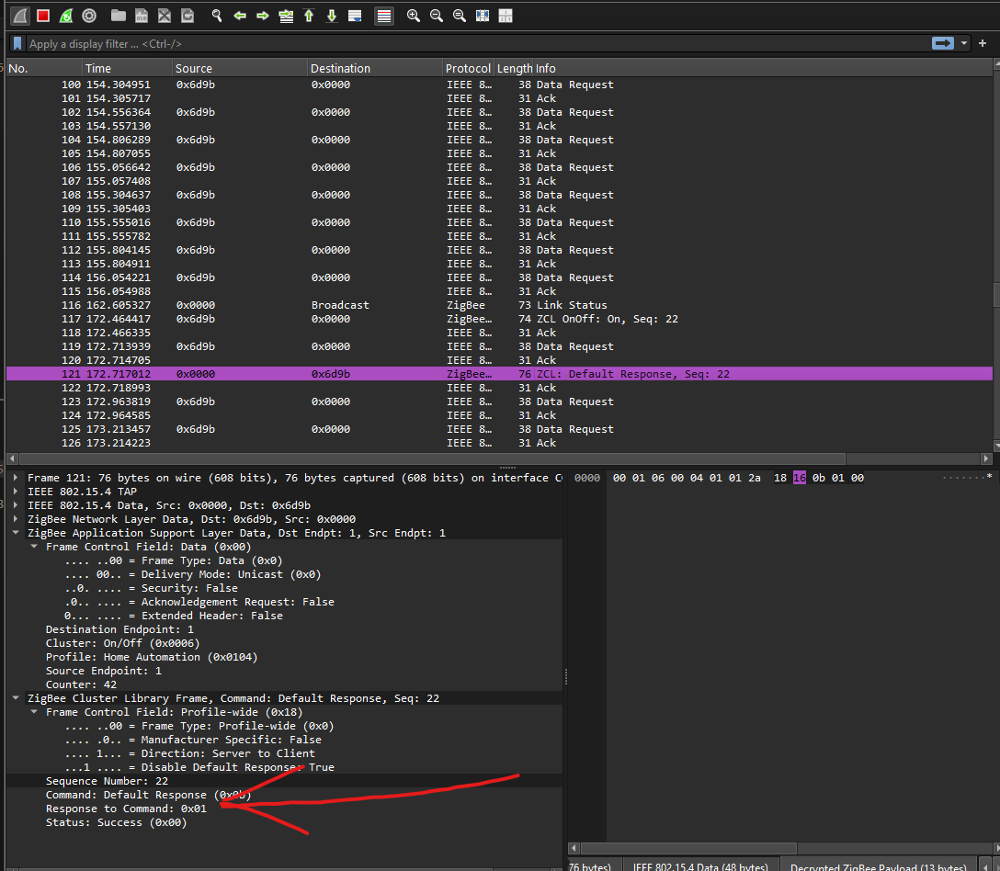
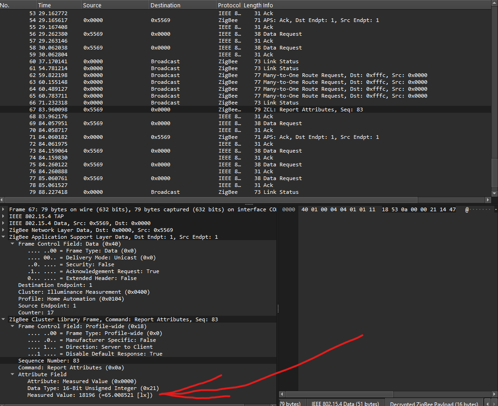
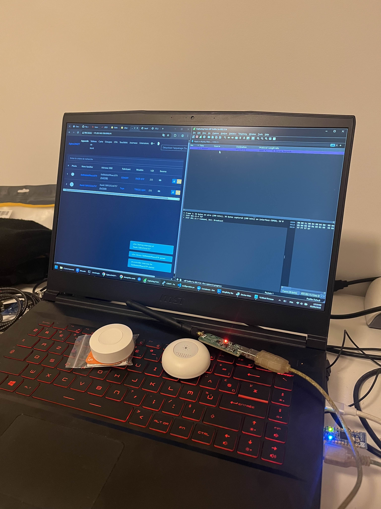

# Images

This folder contains visual references for the Zigbee + Wireshark demo project.

---

## 📡 Topology

Network architecture showing how all components interact:
- Zigbee devices (Sonoff Button, Light Sensor)
- Sonoff Zigbee 3.0 USB Dongle Plus (Coordinator)
- Zigbee2MQTT + Mosquitto (running in WSL Ubuntu)
- MQTT clients/applications
- nRF52840 Dongle used as Zigbee sniffer
- Wireshark (on Windows) for packet analysis

> [!NOTE]  
> The topology diagram is made with Graphviz. The source `.dot` file is included in this folder.

---

## 🔎 Wireshark Decryption

Screenshots of Wireshark successfully decrypting a Zigbee packet using the network key.  
It shows how a raw Zigbee frame maps to higher-level ZCL commands.

### Button double press events:
The `0x01` in the payload indicates a double press action.
`0x00` would indicate a single press and `0x02` a long press.

### Light Sensor reading:
The `=65` in the payload indicates the illuminance measurement.

---

## ⚙️ Hardware Setup

Photo of the physical devices used:
- Sonoff Zigbee 3.0 USB Dongle Plus
- Nordic nRF52840 Dongle
- Sonoff Zigbee Button
- Zigbee Light Sensor

---

> These visuals help illustrate the flow from **physical devices → Zigbee packets → Wireshark decoding → MQTT messages**.
